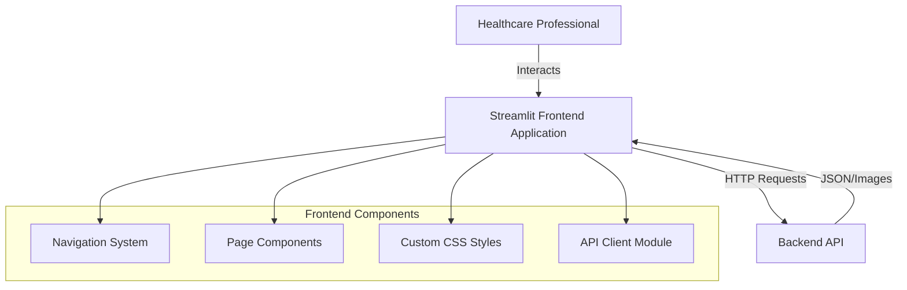
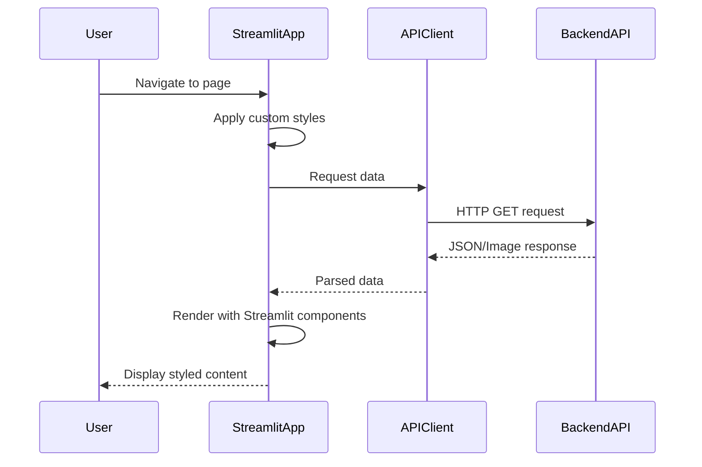

# Design Document: Hospital Data Pipeline Frontend

## Overview

The Hospital Data Pipeline Frontend is a Streamlit-based web application that provides healthcare professionals with an interface to trigger data pipeline execution, view patient data, monitor health anomalies, and visualize healthcare metrics. The application connects to a Backend API and presents data in a clean, professional interface inspired by Vercel's design aesthetic.

### Key Design Principles

1. **Streamlit-Native Foundation**: Use Streamlit's built-in components (st.dataframe, st.button, st.sidebar) as the core UI framework
2. **Custom Styling Layer**: Apply HTML/CSS via st.markdown() with unsafe_allow_html=True to achieve professional aesthetics
3. **Reusable Patterns**: Create consistent styling patterns that can be applied across all pages
4. **Professional Polish**: Ensure the UI doesn't look like a typical AI-generated Streamlit app through careful attention to typography, spacing, and interactions

### Technology Stack

- **Core Framework**: Streamlit (Python web framework)
- **Styling**: Custom HTML + CSS injected via st.markdown()
- **HTTP Client**: requests library for Backend API communication
- **Data Display**: Streamlit's native dataframe component with custom styling
- **Image Display**: Streamlit's native image component for visualizations

### Design Aesthetic Reference

The UI design is inspired by vercel.com, characterized by:
- Clean, minimal layouts with generous whitespace
- Professional typography with clear hierarchy
- Subtle shadows and borders for depth
- Muted color palette with strategic accent colors
- Smooth transitions and hover states
- Responsive design that adapts to screen sizes

## Architecture

### High-Level Architecture



### Application Structure

The application follows a modular structure:

```
frontend/
├── app.py                    # Main Streamlit application entry point
├── config.py                 # Configuration management
├── styles/
│   └── custom_styles.py      # Reusable CSS styling patterns
├── api/
│   └── client.py             # Backend API client
├── pages/
│   ├── run_pipeline.py       # Pipeline execution page
│   ├── patient_master.py     # Patient master view
│   ├── anomalies.py          # Anomalies view
│   ├── vitals.py             # Vitals data view
│   ├── labs.py               # Labs data view
│   └── visualizations.py     # Visualizations view
└── utils/
    └── helpers.py            # Utility functions
```

### Component Interaction Flow



### State Management

Streamlit uses a top-to-bottom execution model where the entire script reruns on each interaction. State management strategy:

1. **Session State**: Use st.session_state for persistent data across reruns
2. **Caching**: Use @st.cache_data for API responses to minimize redundant requests
3. **Loading States**: Track loading status in session state to show appropriate UI feedback

## Components and Interfaces

### 1. Main Application (app.py)

**Responsibility**: Application entry point, page configuration, navigation setup

**Key Functions**:
- `configure_page()`: Set page config (wide layout, title, icon)
- `inject_global_styles()`: Apply custom CSS to entire application
- `render_navigation()`: Display navigation menu
- `route_to_page()`: Load selected page component

**Streamlit Configuration**:
```python
st.set_page_config(
    page_title="Hospital Data Pipeline",
    page_icon="🏥",
    layout="wide",
    initial_sidebar_state="expanded"
)
```

### 2. Custom Styles Module (styles/custom_styles.py)

**Responsibility**: Provide reusable CSS styling patterns

**Key Components**:

- `get_global_styles()`: Returns CSS for typography, colors, spacing
- `get_button_styles()`: Returns CSS for custom button styling
- `get_table_styles()`: Returns CSS for dataframe styling
- `get_card_styles()`: Returns CSS for card/container styling
- `inject_styles(css_string)`: Helper to inject CSS via st.markdown()

**Design Tokens**:
```python
COLORS = {
    'primary': '#0070f3',      # Vercel blue
    'background': '#fafafa',   # Light gray background
    'surface': '#ffffff',      # White cards/surfaces
    'text_primary': '#000000', # Black text
    'text_secondary': '#666666', # Gray text
    'border': '#eaeaea',       # Light border
    'error': '#e00',           # Red for errors
    'success': '#0070f3',      # Blue for success
}

TYPOGRAPHY = {
    'font_family': '-apple-system, BlinkMacSystemFont, "Segoe UI", Roboto, sans-serif',
    'heading_size': '24px',
    'body_size': '14px',
    'small_size': '12px',
}

SPACING = {
    'xs': '4px',
    's': '8px',
    'm': '16px',
    'l': '24px',
    'xl': '32px',
}
```

### 3. API Client Module (api/client.py)

**Responsibility**: Handle all communication with Backend API

**Class**: `HospitalAPIClient`

**Methods**:
- `__init__(base_url: str)`: Initialize with API base URL
- `run_pipeline() -> dict`: Trigger pipeline execution
- `get_patient_master() -> pd.DataFrame`: Fetch patient master data
- `get_anomalies() -> pd.DataFrame`: Fetch anomaly data
- `get_vitals() -> pd.DataFrame`: Fetch vitals data
- `get_labs() -> pd.DataFrame`: Fetch labs data
- `get_visualization(filename: str) -> bytes`: Fetch visualization image
- `_make_request(endpoint: str, method: str) -> requests.Response`: Internal request handler
- `_handle_error(response: requests.Response) -> None`: Internal error handler

**Error Handling**:
- Network errors (connection timeout, DNS failure)
- HTTP errors (4xx, 5xx status codes)
- JSON parsing errors
- Empty response handling

**Interface Example**:
```python
class HospitalAPIClient:
    def __init__(self, base_url: str):
        self.base_url = base_url.rstrip('/')
        self.session = requests.Session()
        self.session.headers.update({'Content-Type': 'application/json'})
    
    def get_patient_master(self) -> pd.DataFrame:
        """Fetch patient master data from API"""
        response = self._make_request('/patient-master', 'GET')
        data = response.json()
        return pd.DataFrame(data)
```

### 4. Configuration Module (config.py)

**Responsibility**: Manage application configuration

**Configuration Items**:
- `API_BASE_URL`: Backend API base URL (default: "http://localhost:8000")
- `REQUEST_TIMEOUT`: HTTP request timeout in seconds (default: 30)
- `CACHE_TTL`: Cache time-to-live in seconds (default: 300)
- `PAGE_NAMES`: List of available pages for navigation

**Environment Variable Support**:
- Read from environment variables if available
- Fall back to defaults if not set

### 5. Page Components

Each page component follows a consistent pattern:

**Common Structure**:
```python
def render():
    """Main render function for the page"""
    st.title("Page Title")
    inject_page_styles()
    
    # Loading state
    with st.spinner("Loading data..."):
        data = fetch_data()
    
    # Error handling
    if data is None:
        st.error("Failed to load data")
        return
    
    # Display content
    display_content(data)

def inject_page_styles():
    """Apply page-specific styles"""
    pass

def fetch_data():
    """Fetch data from API"""
    pass

def display_content(data):
    """Render data with Streamlit components"""
    pass
```

#### 5.1 Run Pipeline Page (pages/run_pipeline.py)

**Components**:
- Pipeline trigger button with custom styling
- Progress log display area
- Stage indicators (Setup → Bronze → Silver → Gold → Visualization)
- Success/error message display

**State Management**:
- `pipeline_running`: Boolean flag in session state
- `pipeline_logs`: List of log messages in session state

#### 5.2 Patient Master Page (pages/patient_master.py)

**Components**:
- Data table with st.dataframe()
- Column configuration for optimal display
- Search/filter controls
- Row count indicator

**Data Display**:
- Use st.dataframe() with custom CSS
- Enable sorting and filtering
- Highlight key columns

#### 5.3 Anomalies Page (pages/anomalies.py)

**Components**:
- Anomaly table with severity indicators
- Filter by anomaly type
- Color-coded anomaly types
- Patient ID links (if applicable)

**Anomaly Types**:
- High Heart Rate (HR > 120 bpm) - Red indicator
- Low Oxygen (OX < 92%) - Orange indicator
- High Blood Pressure (SYS > 160 OR DIA > 100) - Red indicator

#### 5.4 Vitals Page (pages/vitals.py)

**Components**:
- Vitals data table
- Date range filter
- Patient filter
- Export functionality (Streamlit built-in)

#### 5.5 Labs Page (pages/labs.py)

**Components**:
- Labs data table
- Date range filter
- Patient filter
- Export functionality (Streamlit built-in)

#### 5.6 Visualizations Page (pages/visualizations.py)

**Components**:
- Three visualization sections with custom cards
- Image display with st.image()
- Loading indicators for each visualization
- Error handling per visualization

**Layout**:
- Use Streamlit columns for responsive layout
- Display visualizations in a grid
- Add descriptive captions

### 6. Navigation System

**Implementation Options**:

**Option A: Sidebar Radio Buttons** (Recommended)
```python
page = st.sidebar.radio(
    "Navigation",
    ["Run Pipeline", "Patient Master", "Anomalies", "Vitals", "Labs", "Visualizations"]
)
```

**Option B: Sidebar Selectbox**
```python
page = st.sidebar.selectbox(
    "Select Page",
    ["Run Pipeline", "Patient Master", "Anomalies", "Vitals", "Labs", "Visualizations"]
)
```

**Styling**:
- Custom CSS to style radio buttons/selectbox
- Active page highlighting
- Icon support via Unicode or emoji

### 7. Utility Functions (utils/helpers.py)

**Functions**:
- `format_timestamp(ts: str) -> str`: Format timestamps for display
- `format_number(num: float, decimals: int) -> str`: Format numbers with proper precision
- `create_download_link(df: pd.DataFrame, filename: str) -> str`: Generate CSV download link
- `validate_api_url(url: str) -> bool`: Validate API URL format

## Data Models

### API Response Models

#### Patient Master Response
```python
{
    "patient_id": str,
    "latest_hr": float,
    "latest_ox": float,
    "latest_lab_value": float,
    "last_vitals_timestamp": str,
    "last_lab_timestamp": str
}
```

#### Anomaly Response
```python
{
    "patient_id": str,
    "timestamp": str,
    "anomaly_type": str,  # "High Heart Rate" | "Low Oxygen" | "High Blood Pressure"
    "value": float,
    "threshold": float
}
```

#### Vitals Response
```python
{
    "patient_id": str,
    "timestamp": str,
    "heart_rate": float,
    "oxygen_level": float
}
```

#### Labs Response
```python
{
    "patient_id": str,
    "timestamp": str,
    "test_name": str,
    "test_value": float,
    "unit": str
}
```

#### Pipeline Response
```python
{
    "status": str,  # "success" | "error"
    "message": str,
    "stages": [
        {
            "name": str,  # "Setup" | "Bronze" | "Silver" | "Gold" | "Visualization"
            "status": str,  # "completed" | "failed"
            "timestamp": str
        }
    ]
}
```

### Frontend Data Models

#### Session State Schema
```python
{
    "api_client": HospitalAPIClient,
    "current_page": str,
    "pipeline_running": bool,
    "pipeline_logs": List[str],
    "cached_data": {
        "patient_master": pd.DataFrame,
        "anomalies": pd.DataFrame,
        "vitals": pd.DataFrame,
        "labs": pd.DataFrame
    },
    "last_refresh": datetime
}
```

## Correctness Properties

